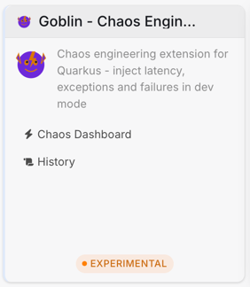
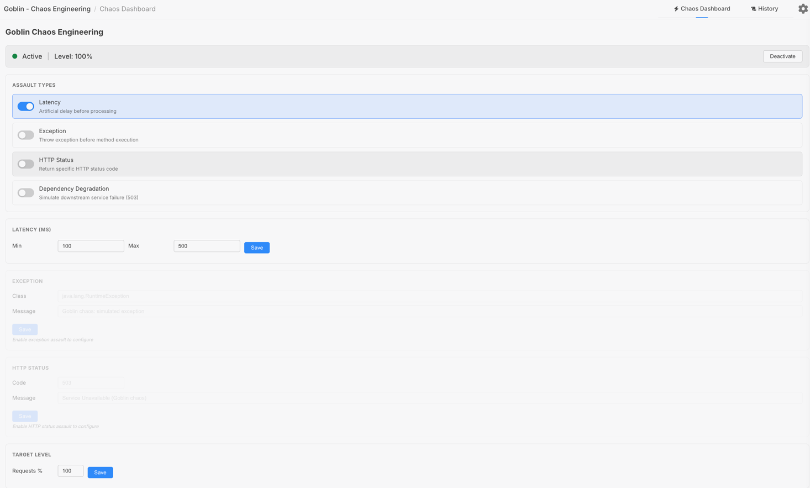
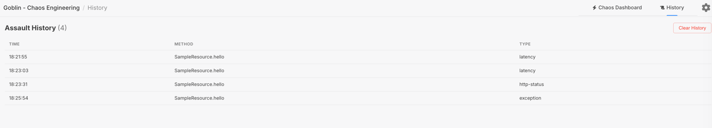

= Goblin - Chaos Engineering Extension for Quarkus

:toc: left
:toclevels: 3

include::../partials/attributes.adoc[]

Goblin is a chaos engineering extension for Quarkus that lets you inject latency, exceptions, HTTP failures, and dependency degradation into your running application -- without touching a single line of source code.

It is designed for one specific purpose: **verifying that your resilience mechanisms actually work**. You declared `@Timeout`, `@Fallback`, `@Retry`, health probes, or circuit breakers? Goblin gives you the tool to prove they hold under real failure conditions.

TIP: Think of Goblin as https://github.com/codecentric/chaos-monkey-spring-boot[Chaos Monkey] for the Quarkus ecosystem -- but with stronger safety guarantees.

== Why Goblin?

Quarkus has excellent resilience primitives (MicroProfile Fault Tolerance, Mutiny reactive timeouts, health probes), but no built-in way to *trigger* the failures these mechanisms are supposed to handle. You end up writing fragile integration tests that mock exceptions, or worse, discovering production failure modes for the first time in production.

Goblin fills that gap: inject realistic failures at the HTTP layer during development, observe how your application reacts, and iterate.

Key design decisions:

* **Dev mode only.** Chaos artifacts are physically absent from production builds. Not disabled -- absent. There is no toggle to forget to switch off.
* **Zero code modification.** No `@ChaosLatency` annotations to scatter across your endpoints. Configuration is the only interface.
* **Non-destructive.** You can target specific packages, exclude annotated methods, and control the percentage of affected requests.
* **Composable.** Multiple assault types can be active simultaneously on the same request.

== Quick start

=== Add the dependency

[source,xml]
----
<dependency>
    <groupId>io.quarkiverse.goblin</groupId>
    <artifactId>quarkus-goblin</artifactId>
    <version>${goblin.version}</version>
</dependency>
----

That's it. Start your application in dev mode:

[source,bash]
----
./mvnw quarkus:dev
----

You will see a warning log confirming chaos is active:

[source]
----
WARN  Chaos engineering active: 100% of REST requests subject to assault (latency=true, exception=false, httpStatus=false, dependencyDegradation=false)
----

=== Verify it works

With the default configuration (latency assault enabled, 100% of requests), every REST endpoint will have an artificial delay applied. Hit any endpoint and observe the added latency:

[source,bash]
----
curl -w "\nTime: %{time_total}s\n" http://localhost:8080/api/hello
----

You should see a response time well above your normal baseline.

== Assault types

Goblin supports four types of chaos assaults. Each type has its own **boolean toggle** -- you can enable multiple types simultaneously on the same request.

When multiple types are active, they are applied in order:

1. **Latency** -- adds delay before processing (applied first).
2. **Exception** -- throws an exception, aborting the request.
3. **HTTP Status** -- returns a specific status code, aborting the request.
4. **Dependency Degradation** -- returns 503, aborting the request.

TIP: If both latency and exception are enabled, the delay is applied first, then the exception is thrown. This simulates a slow failure -- realistic for testing timeouts followed by fallbacks.

=== LATENCY

Injects a random delay (between `min-milliseconds` and `max-milliseconds`) before processing the request. Useful for testing timeouts, circuit breakers, and retry mechanisms.

[source,properties]
----
quarkus.goblin.assault.latency.min-milliseconds=500
quarkus.goblin.assault.latency.max-milliseconds=5000
----

The delay is applied via `Thread.sleep()` in the JAX-RS filter, before the request reaches your endpoint logic.

=== EXCEPTION

Throws a configurable exception before the request reaches the endpoint. The exception class and message are fully configurable.

[source,properties]
----
quarkus.goblin.assault.exception.type=java.io.IOException
quarkus.goblin.assault.exception.message=Connection refused to downstream service
----

The exception must have a constructor that accepts a single `String` parameter (the message). `RuntimeException` is used as a fallback if the specified class cannot be instantiated.

=== HTTP_STATUS

Returns a specific HTTP status code without executing the endpoint method at all. The request is aborted at the filter level.

[source,properties]
----
quarkus.goblin.assault.http-status.code=503
quarkus.goblin.assault.http-status.message=Service Unavailable (simulated outage)
----

Common use case: verify that your frontend handles 503 responses gracefully.

=== DEPENDENCY_DEGRADATION

Returns 503 with a "Dependency unavailable" message. Designed for testing `@Fallback` and `@Retry` on outbound service calls. No additional configuration needed -- it uses a fixed 503 response.

== Targeting

By default, Goblin affects **all REST endpoints** in your application. You can narrow or expand this scope with targeting configuration.

=== Percentage-based targeting

Control what fraction of incoming requests are affected (0-100%):

[source,properties]
----
# Only affect 10% of requests (useful for simulating intermittent failures)
quarkus.goblin.target.level=10
----

Setting `level=0` effectively disables chaos without removing the extension. Setting `level=100` (default) affects every request.

=== Package filtering

Include only specific packages:

[source,properties]
----
quarkus.goblin.target.include-packages=com.example.api,com.example.internal
----

Exclude specific packages:

[source,properties]
----
quarkus.goblin.target.exclude-packages=com.example.health,com.example.metrics
----

The filter matches on the declaring class's package name using `startsWith`, so `com.example` will match `com.example.api`, `com.example.internal`, etc.

=== Annotation-based exclusion

Exclude methods (or their declaring classes) that carry specific annotations. This is particularly useful for coexisting with MicroProfile Fault Tolerance:

[source,properties]
----
# Don't inject chaos on endpoints that already have fault tolerance annotations
quarkus.goblin.target.exclude-annotations=org.eclipse.microprofile.faulttolerance.Timeout,org.eclipse.microprofile.faulttolerance.Fallback
----

This prevents double-interception: you can chaos-test your unprotected endpoints while leaving fault-tolerant ones to their own mechanisms.

== Full configuration reference

All configuration keys are under the `quarkus.goblin` prefix.

[cols="3,1,1,3"]
|===
| Key | Type | Default | Description

| `quarkus.goblin.enabled`
| `boolean`
| `true`
| Enable/disable the Goblin extension. Only takes effect in dev mode.

| `quarkus.goblin.assault.type`
| `AssaultType`
| `LATENCY`
| Initial assault type enabled at startup. Values: `LATENCY`, `EXCEPTION`, `HTTP_STATUS`, `DEPENDENCY_DEGRADATION`. Can be changed at runtime via the Dev UI.

| `quarkus.goblin.assault.latency.min-milliseconds`
| `long`
| `100`
| Minimum latency in milliseconds

| `quarkus.goblin.assault.latency.max-milliseconds`
| `long`
| `5000`
| Maximum latency in milliseconds

| `quarkus.goblin.assault.exception.type`
| `String`
| `java.lang.RuntimeException`
| Fully qualified exception class name

| `quarkus.goblin.assault.exception.message`
| `String`
| `Goblin chaos: simulated exception`
| Exception message

| `quarkus.goblin.assault.http-status.code`
| `int`
| `503`
| HTTP status code to return

| `quarkus.goblin.assault.http-status.message`
| `String`
| `Service Unavailable (Goblin chaos)`
| HTTP response body

| `quarkus.goblin.target.level`
| `int`
| `100`
| Percentage of requests to affect (0-100)

| `quarkus.goblin.target.include-packages`
| `Optional<String[]>`
| _empty_
| Packages to include (empty = all packages)

| `quarkus.goblin.target.exclude-packages`
| `Optional<String[]>`
| _empty_
| Packages to exclude from chaos

| `quarkus.goblin.target.exclude-annotations`
| `Optional<String[]>`
| _empty_
| Exclude methods/classes carrying these annotations
|===

== Dev UI panel

When running in dev mode, Goblin provides a control panel in the Quarkus Dev UI (accessible at `/q/dev`). You reach it by clicking the **Goblin** card in the extension grid:

[.text-center]
The Goblin card in the Dev UI extension grid.

=== Chaos Dashboard

The dashboard is the main control surface. It exposes the master toggle, per-type toggles, per-type configuration forms, and the target level.

[.text-center]
The Chaos Dashboard with latency enabled at 100% target level.

* **Master toggle** -- Activate/deactivate all chaos with a single click. When inactive, the status dot turns red and the `Deactivate` button becomes `Activate`.
* **Assault type toggles** -- Independent on/off switches for each assault type (Latency, Exception, HTTP Status, Dependency Degradation). Multiple types can be active simultaneously. Enabled types are highlighted with the Quarkus primary color.
* **Config sections** -- Each assault type has its own configuration section (latency range, exception class/message, HTTP status code/message). Sections are always visible but disabled with placeholder text when the type is off. Enable the type to edit its parameters. Every section has its own `Save` button.
* **Target level** -- Adjust the percentage of affected requests (0-100%) on the fly, saved with its own button.
* **All changes apply instantly** -- no restart needed. A WARN log is emitted in the console for every change, and a toast confirms each action in the UI.

NOTE: When chaos is deactivated, the configuration sections remain visible but are dimmed and their inputs disabled -- you can prepare your assault configuration before turning chaos on.

=== History

A real-time log of every assault triggered, including the endpoint method, assault type, and timestamp. Clear the history between test sessions.

[.text-center]
The Assault History panel showing past triggered assaults.

The history is an in-memory buffer capped at the latest 1000 assaults. Use it to confirm that your targeting rules and level are applying to the expected endpoints before drawing conclusions about your resilience checks.

== How it works

Goblin operates at the JAX-RS filter layer using a `ContainerRequestFilter`:

1. At build time, the deployment module registers the filter and the `goblin` feature with Quarkus.
2. At runtime startup, the `AssaultEngine` is initialized with the configuration and activated (in dev/test mode only).
3. For every incoming HTTP request, the filter checks:
   * Is chaos active?
   * Should this specific request be affected? (based on the `level` percentage)
   * Is the target endpoint eligible? (based on package/annotation filters)
4. If all conditions are met, all enabled assault types are applied in order: latency first (delay), then exception/HTTP-status/dependency-degradation (which abort the request).
5. An assault record is added to the history buffer (capped at 1000 entries).

The filter runs early in the JAX-RS pipeline, before any endpoint logic executes. This means:

* Exception and HTTP_STATUS assaults **completely bypass** your endpoint code -- no side effects, no partial state mutations.
* Latency assaults add delay **before** processing, simulating network or upstream slowness.

=== Runtime config modification

All assault parameters can be modified at runtime through the Dev UI or via JSON-RPC. The initial config is loaded from `application.properties` at startup, then held in a mutable in-memory config (`MutableAssaultConfig`). This means you can:

* Enable latency AND exception simultaneously to simulate a slow failure.
* Toggle assault types on/off without restarting.
* Change the latency range, exception class, or HTTP status code on the fly.
* Drop the target level from 100% to 10% to test intermittent failures.

Changes take effect on the **next request** -- no restart, no redeployment. A WARN log confirms every change in the console.

== Compatibility

=== MicroProfile Fault Tolerance

Goblin is designed to coexist with Fault Tolerance annotations. The typical workflow:

1. Configure chaos on unprotected endpoints (default behavior).
2. Exclude fault-tolerant endpoints via `quarkus.goblin.target.exclude-annotations`.
3. Verify that the unprotected endpoints fail as expected.
4. Remove the exclusion, chaos-test the fault-tolerant endpoints to confirm `@Timeout` and `@Fallback` trigger correctly.

=== RESTEasy Reactive vs classic JAX-RS

Goblin uses standard JAX-RS `ContainerRequestFilter` / `ContainerResponseFilter`, which work with both RESTEasy Reactive and the classic RESTEasy runtime.

== Troubleshooting

*Chaos is not activating:*

* Verify you are running in dev mode (`quarkus:dev`), not in test or production mode.
* Check that `quarkus.goblin.enabled=true` (the default).
* Verify at least one assault type is enabled in the Dev UI.
* Look for the WARN log at startup confirming chaos activation.

*Endpoints are returning 500:*

* If using EXCEPTION assault, verify the exception class exists and has a `String` constructor.
* Check the Quarkus dev console for stack traces.

*Targeting filters not working:*

* Package matching uses `startsWith`, so `com.example` matches `com.example.api` and `com.example.internal`.
* Annotation matching uses fully qualified class names, not simple names. Use `jakarta.ws.rs.GET`, not `GET`.

*Dev UI config changes not visible:*

* Check the Quarkus console for WARN logs confirming the change.
* Changes are in-memory only -- they reset on restart. Use `application.properties` for persistent defaults.

== End-to-end example: prove your @Timeout works

This walkthrough exercises a realistic scenario: verifying that a MicroProfile `@Timeout` and `@Fallback` react correctly when a downstream call becomes slow.

. Start the sample application in dev mode:
+
[source,bash]
----
./mvnw -pl integration-tests quarkus:dev
----

. Configure a latency assault that exceeds your `@Timeout` threshold. If the downstream endpoint has a `@Timeout(1000)` (1 second), set a latency range well above it:
+
[source,properties]
----
quarkus.goblin.enabled=true
quarkus.goblin.assault.type=LATENCY
quarkus.goblin.assault.latency.min-milliseconds=2000
quarkus.goblin.assault.latency.max-milliseconds=4000
quarkus.goblin.target.level=100
# Exclude other fault-tolerant endpoints so only the one under test is affected
----

. Open the Dev UI at `http://localhost:8080/q/dev` and confirm latency is enabled in the Chaos Dashboard.

. Call the endpoint under test and observe the response time and whether the fallback was invoked:
+
[source,bash]
----
curl -w "\nstatus=%{http_code} time=%{time_total}s\n" http://localhost:8080/api/hello
----

. Check the **Assault History** panel to confirm the latency assault was recorded against the expected method.

. Repeat with `quarkus.goblin.target.level=10` to observe intermittent, non-deterministic failures -- the hardest scenario to get right in production.

== JSON-RPC reference

The Dev UI talks to the runtime through a JSON-RPC service (`GoblinJsonRPCService`). The same service is available over the Dev UI's built-in JSON-RPC bridge, which is useful for scripting or CI validation. All methods read or mutate the in-memory `MutableAssaultConfig`.

[cols="2,3"]
|===
| Method | Effect

| `getStatus`
| Returns `active`, the four assault toggles, and the target `level`.

| `getConfig`
| Returns the full mutable config (toggles, latency range, exception config, HTTP status config, level).

| `toggleActive` / `setActive(boolean)`
| Enable/disable chaos entirely. Emits a WARN log.

| `toggleLatency` / `toggleException` / `toggleHttpStatus` / `toggleDependencyDegradation`
| Flip the corresponding assault toggle on/off.

| `setLatencyRange(minMs, maxMs)`
| Set the min/max latency range.

| `setExceptionConfig(type, message)`
| Set the exception class name and message.

| `setHttpStatusConfig(code, message)`
| Set the HTTP status code and response body.

| `setTargetLevel(level)`
| Set the percentage of affected requests (clamped to 0-100).

| `getHistory`
| Return the assault history buffer.

| `clearHistory`
| Empty the assault history buffer.
|===

== FAQ

*Does Goblin run in production?*

No. The chaos implementation lives in the `runtime-dev` module, which is only attached in dev mode. In a production build the artifacts are physically absent -- there is no configuration that can re-enable them.

*Do I need to annotate my endpoints?*

No. Goblin intercepts at the JAX-RS filter level automatically. The only interface is configuration, either static (`application.properties`) or dynamic (Dev UI / JSON-RPC).

*What is the maximum assault history size?*

The history buffer is capped at the latest 1000 entries; the oldest are dropped automatically.

*Can I combine latency and exception to simulate a slow failure?*

Yes. Multiple assault types can be active on the same request. In that case the latency (delay) is applied first, then the exception is thrown -- ideal for verifying that `@Timeout` triggers before `@Fallback`, or that a fallback handles an exception raised after a slow response.

*What happens if my exception class cannot be constructed?*

If the configured class does not exist or has no `String` constructor, Goblin falls back to a `RuntimeException` carrying the configured message. See the *Troubleshooting* section.

*Are Dev UI changes persisted?*

No. Runtime changes are held in an in-memory `MutableAssaultConfig` and reset on restart. Use `application.properties` for any defaults that must survive a restart.

== Non-goals (out of scope for V1)

* **Infrastructure chaos** (pod killing, network partitioning) -- use Chaos Mesh, Litmus, or Pumba for that.
* **Production/staging chaos** -- may be explored in a future version with a completely different safety model (explicit opt-in, time-bounded windows, audit trail).
* **Native compilation** -- to be validated separately once the core mechanism is proven on JVM.

== Requirements

* Java {java-version} or later
* Quarkus {quarkus-version} or later
